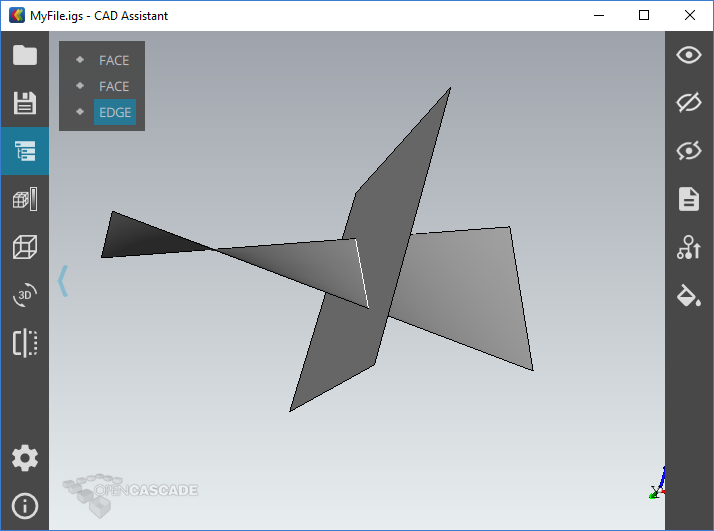
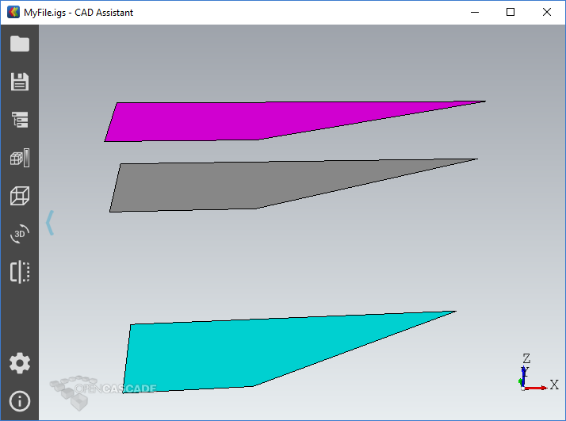

# SearchAThing.Solid

C# Interfacing of [OpenCascade](http://www.opencascade.com/) 3d kernel.

## License

The SearchAThing.Solid library is licensed under [MIT](LICENSE.md).

Follow thirdy part libraries are used:

- OpenCascade [LGPL-2.1](LICENSE.Thirdy/OpenCascade)
- FreeImage [FreeImage Public License - Version 1.0](LICENSE.Thirdy/FreeImage/license-fi.txt)
- FreeType [The FreeType Project LICENSE](LICENSE.Thirdy/Freetype/FTL.TXT)
- GL2PS [GL2PS LICENSE - Version 2, November 2003](LICENSE.Thirdy/gl2ps/COPYING.GL2PS.txt)
- Qt486 [LGPL 2.1](LICENSE.Thirdy/Qt486/LICENSE.LGPL.txt)
- tbb [GPL](LICENSE.Thirdy/tbb/COPYING.txt) with [exceptions](https://www.threadingbuildingblocks.org/licensing)
- tcltk [ActiveTcl Community License Agreement](LICENSE.Thirdy/tcltk/license-at8.6-thread.terms.txt)
- vtk [Copyright (c) 1993-2008 Ken Martin, Will Schroeder, Bill Lorensen](LICENSE.Thirdy/vtk/Copyright.txt)

## Features

This project is a working in progress and only some entities from the OpenCascade kernel are mapped ( actually there are fews and only those I need for my own projects ).

## Examples

### Example01



[source code](src/SearchAThing.Solid.Example01/Program.cs)

```csharp
IGESControl_Controller.Init();
var writer = new IGESControl_Writer("MM", 0);

var face1 = Toolkit.FromEdges(
    new Line3D(new Vector3D(-10, 0, 0), new Vector3D(20, 0, 0)),
    new Line3D(new Vector3D(-10, 10, 0), new Vector3D(20, 10, 15)));

writer.AddShape(face1);

var face2 = Toolkit.FromEdges(
    new Line3D(new Vector3D(7.5, -5, -5), new Vector3D(7.5, 15, -5)),
    new Line3D(new Vector3D(7.5, -5, 15), new Vector3D(7.5, 15, 15)));

writer.AddShape(face2);

var s1 = face1.Surface();
var s2 = face2.Surface();

var a = new GeomAPI_IntSS(s1, s2, 1e-1);

var C = a.Line(1);

var edge = new BRepBuilderAPI_MakeEdge(C, C.FirstParameter(), C.LastParameter());

var v1 = edge.Vertex1();
var v2 = edge.Vertex2();

var i1 = BRep_Tool.Pnt(v1);
var i2 = BRep_Tool.Pnt(v2);

Console.WriteLine($"Intersection line = {i1}-{i2}");

writer.AddGeom(C.This());
writer.ComputeModel();

writer.Write("MyFile.igs");

Process.Start(AppDomain.CurrentDomain.BaseDirectory);
```

### Example02

This example shows how to offset a `Face` using the `Offset` extension method specifying an offset reference point. In the example:
- magenta face has a `sideRefPt` of (0,0,1)
- cyan face has a `sideRefPt` of (0,0,-1)



[source code](src/SearchAThing.Solid.Example02/Program.cs)

```csharp
Console.WriteLine(Environment.CurrentDirectory);

IGESControl_Controller.Init();
var writer = new IGESControl_Writer("MM", 0);

var face = Toolkit.FromEdges(
new Line3D(new Vector3D(0, 0, 0), new Vector3D(10, 0, 0)),
new Line3D(new Vector3D(0, 10, 0), new Vector3D(30, 10, 0)));

writer.AddShape(face);
writer.AddShape(face.Offset(5, new Vector3D(0, 0, 1)));
writer.AddShape(face.Offset(15, new Vector3D(0, 0, -1)));

writer.ComputeModel();
writer.Write("MyFile.igs");

Process.Start(AppDomain.CurrentDomain.BaseDirectory);
```

## Build

### Install OpenCascade

Before you start with use of this library you need to:
- download and install [opencascade VC++ 2013 64 bit](http://www.opencascade.com/content/latest-release).

### Setup the solution configuration
- adjust reference libreries on the `SearchAThing.Solid.Wrapper` library in the Property Page :
    - C/C++ -> Additional Include Directories ( `C:\OpenCASCADE7.0.0-vc12-64\opencascade-7.0.0\inc` )
    - Linker -> Additional Library Directories
        - if use the distribution libraries (w/out debug symbol) : `C:\occt-amd64\win64\vc14\libd`
        - if use a built from source version : `C:\occt-amd64\win64\vc14\libd`
    - Linker -> Input -> Additional Dependencies :
    
```
FWOSPlugin.lib
TKBin.lib
TKBinL.lib
TKBinTObj.lib
TKBinXCAF.lib
TKBO.lib
TKBool.lib
TKBRep.lib
TKCAF.lib
TKCDF.lib
TKD3DHost.lib
TKDCAF.lib
TKDraw.lib
TKernel.lib
TKFeat.lib
TKFillet.lib
TKG2d.lib
TKG3d.lib
TKGeomAlgo.lib
TKGeomBase.lib
TKHLR.lib
TKIGES.lib
TKIVtk.lib
TKIVtkDraw.lib
TKLCAF.lib
TKMath.lib
TKMesh.lib
TKMeshVS.lib
TKOffset.lib
TKOpenGl.lib
TKPrim.lib
TKQADraw.lib
TKService.lib
TKShHealing.lib
TKStd.lib
TKStdL.lib
TKSTEP.lib
TKSTEP209.lib
TKSTEPAttr.lib
TKSTEPBase.lib
TKSTL.lib
TKTObj.lib
TKTObjDRAW.lib
TKTopAlgo.lib
TKTopTest.lib
TKV3d.lib
TKVCAF.lib
TKViewerTest.lib
TKVRML.lib
TKXCAF.lib
TKXDEDRAW.lib
TKXDEIGES.lib
TKXDESTEP.lib
TKXMesh.lib
TKXml.lib
TKXmlL.lib
TKXmlTObj.lib
TKXmlXCAF.lib
TKXSBase.lib
TKXSDRAW.lib
```

- Setup C# dll libraries using follow Property -> Build Events -> Pre-build event command line :
    
```
echo "Copy reference dlls..."
xcopy /d /y C:\OpenCASCADE7.0.0-vc12-64\opencascade-7.0.0\win64\vc12\bin\*.* $(TargetDir)
xcopy /d /y C:\OpenCASCADE7.0.0-vc12-64\tbb42_20140416oss\bin\intel64\vc12\*.dll $(TargetDir)
xcopy /d /y C:\OpenCASCADE7.0.0-vc12-64\tbb42_20140416oss\bin\intel64\vc12\irml\*.dll $(TargetDir)
xcopy /d /y C:\OpenCASCADE7.0.0-vc12-64\freeimage-3.17.0-vc12-64\bin\*.dll $(TargetDir)
xcopy /d /y C:\OpenCASCADE7.0.0-vc12-64\freetype-2.5.5-vc12-64\bin\*.dll $(TargetDir)
xcopy /d /y C:\OpenCASCADE7.0.0-vc12-64\gl2ps-1.3.8-vc12-64\bin\*.dll $(TargetDir)
xcopy /d /y C:\OpenCASCADE7.0.0-vc12-64\tcltk-86-64\bin\*.dll $(TargetDir)
xcopy /d /y C:\OpenCASCADE7.0.0-vc12-64\vtk-6.1.0-vc12-64\bin\*.dll $(TargetDir)
echo "done."
```

- Enable **native code debugging** in your C# Project Properties -> Debug to enable debug of C++ code from `SearchAThing.Solid.Wrapper`

    This pre-build action ensure all required dll files available where the exe application will run.

### Build OpenCascade

In order to build a distribution with debugging symbol useful to coding you need to install CMake-3.6 and start the GUI then choose:

- Where is the source code : `C:\OpenCASCADE7.0.0-vc12-64\opencascade-7.0.0`
- Where to build the binaries : `c:\occt-amd64`
- Start the Configure a first time and a set of RED will appears, now sets:
    - 3RDPARTY_DIR : `C:/OpenCASCADE7.0.0-vc12-64`
    - enable modules you want to include
    - retry Configure until all reds goes away
- Start the Generate and choose `Visual Studio 14 2015 Win64`
- Close the CMake GUI and open the solution file `C:\occt-amd64\OCCT.sln` : build the solution takes about 1 hour

More informations about build opencascade with cmake available [here](http://dev.opencascade.org/doc/overview/html/occt_dev_guides__building_cmake.html).
